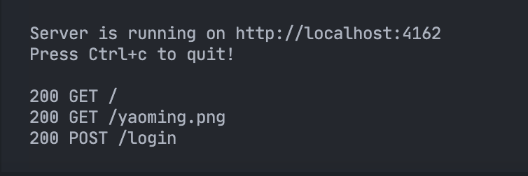
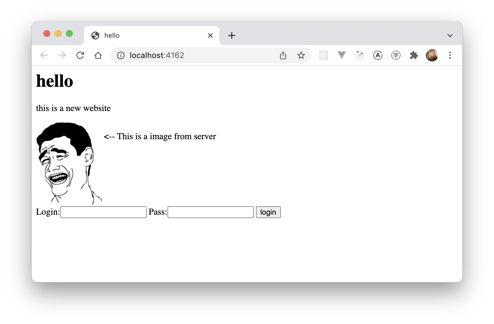
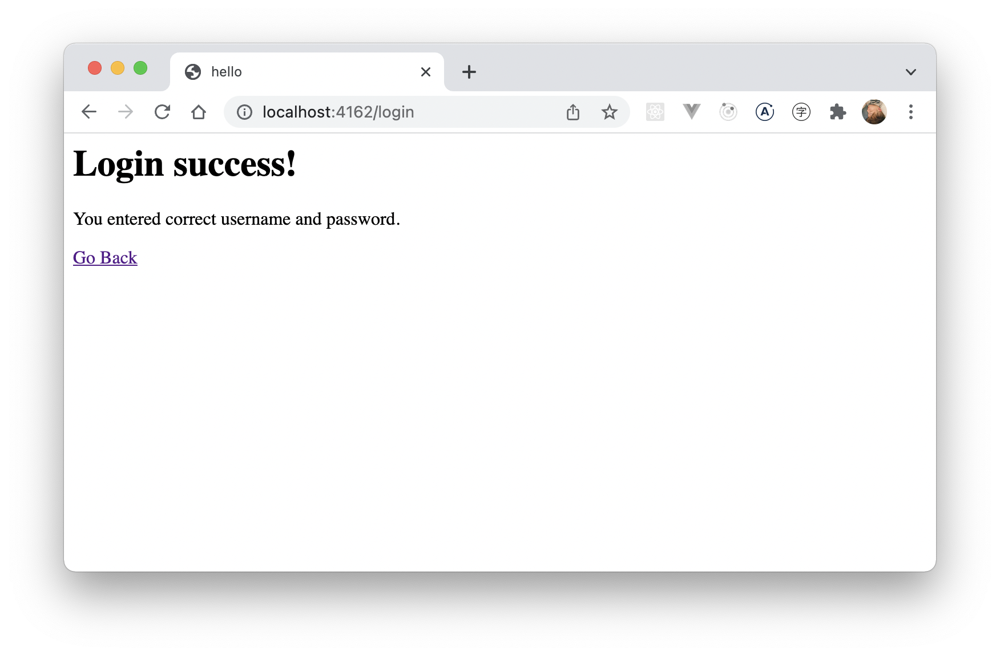

# cpp-http-server

A minimal http server using `<sys/socket.h>` and `<thread>` library.

## Build and Run

```bash
make run
```

Note: compile only test on the following compiler:

```
Apple clang version 13.0.0 (clang-1300.0.29.3)
Target: arm64-apple-darwin21.1.0
Thread model: posix 
```

If you cannot compile in your environment, try to using docker:

```
docker build -t cpp-http-server .
docker run -p 6167:6167 cpp-http-server
```

## Screenshots

 
 
 